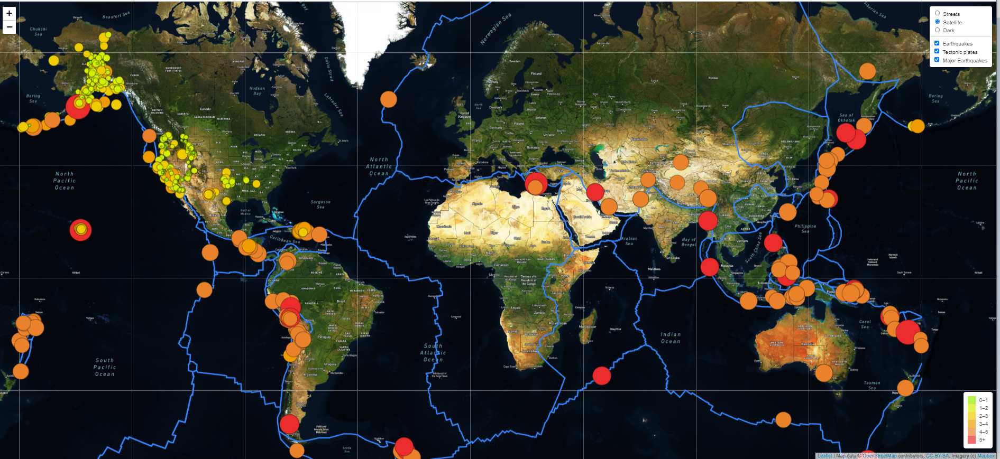

# Mapping Earthquakes

## Overview
Build insightful data visualizations with interactive features on earthquakes from around the world. Using javascript, d3 and leaflet libraries we'll traverse and retrieve earthquake data wich we will plot a mapbox map through an api request.

## Features of the map
Three tile layers will be created and added to the map. Usin the mapbox styles API we'll use the street, dark and satellite view. These three are the basemaps layers.
On the map, the magintude and location of each earthquake will be shown in a popup marker. The diameter of the markers for each earthquake should reflect the magnitude of the earhtquake in their size and color. Higher magnitudes will appear larger and darker in color, with a legend providing the context for the map data. 
Adding fault line on the map illustrate the relationship between the location and frequency of seismic activity and tectonic plates.

## Results

